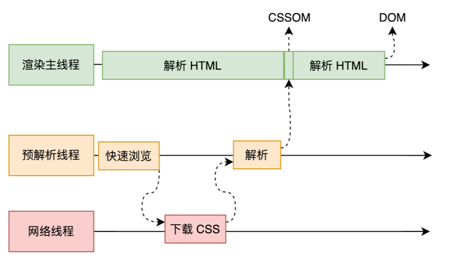
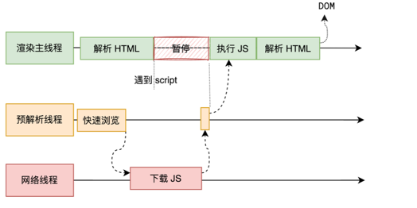
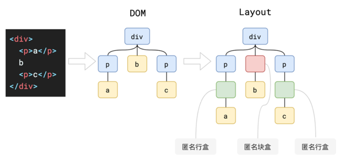

主要流程：
`HTML` 字符串 => 解析 `HTML` => 样式计算 => 布局 => 分层 => 绘制 => 分块 => 光栅化 => 画 => 像素信息

## 1. parse `HTML`

解析 `dom` （`document object model`） 和 `css` （`css object model`）

### css 解析

为了提⾼解析效率，浏览器会启动⼀个预解析器率先下载和解析 `CSS`




### js 解析

渲染主线程遇到 `JS` 时必须暂停⼀切⾏为，等待下载执⾏完后才能继续

预解析线程可以分担⼀点下载 `JS` 的任务



## 2. 样式计算 recalculate style

`dom` 和 `com` 通过样式计算，最终在 `dom` 树中呈现的 `css` 样式, 在 `computed style` 中查看。

### 3. 布局 layout

`dom` 经过最终布局会形成 `layout` 树

`dom` 树和 `layout` 不一定是一一对应的

1.  `dom` 中的 `display: none` 不会显示在 `layout` 中
2. 伪元素 `::before` 会显示在 `layout` 中
3. 行盒和块盒

文本内容必须在行盒中。

行盒和块盒不能相邻。



### 4. 分层 layer

分层的好处：即使浏览器卡死，也会有动画效果。

浏览器会自动分层，在图层面板中查看。

堆叠上下文有关的影响分层 `z-index`, `opacity`, `transform`。

告诉浏览器需要分层：`will-change: transform`

### 5. 绘制 paint

浏览器的绘制是异步的。

### 6. 分块 tiling

浏览器会将每一层分为多个小的区域，以便于优先渲染可视区域内的小块。

分块是多个线程同时进行的。

### 7. 光栅化 rasterization

光栅化是把每个小块渲染成位图，优先处理靠近可视区域的块。

### 8. 画 draw

合成线程会计算每个位图在屏幕上的位置，然后通过 `GPU` 渲染到屏幕上。

`GPU` 进程通过 `quad` 绘制

完整流程：

渲染主线程： parse => recalculate style => layout => layer => paint =》 合成线程： tiling => rasterization => draw

**注意**：渲染进程是在沙盒里面进行的，因此他是很安全的，所以无法获取 `CPU` 和 `GPU`，不能直接去操作系统。

## 浏览器是如何渲染页面的？

当浏览器的网络线程收到 HTML 文档后，会产生一个渲染任务，并将其传递给渲染主线程的消息队列。

在事件循环机制的作用下，渲染主线程取出消息队列中的渲染任务，开启渲染流程。

-------

整个渲染流程分为多个阶段，分别是： HTML 解析、样式计算、布局、分层、绘制、分块、光栅化、画

每个阶段都有明确的输入输出，上一个阶段的输出会成为下一个阶段的输入。

这样，整个渲染流程就形成了一套组织严密的生产流水线。

-------

渲染的第一步是**解析 HTML**。

解析过程中遇到 CSS 解析 CSS，遇到 JS 执行 JS。为了提高解析效率，浏览器在开始解析前，会启动一个预解析的线程，率先下载 HTML 中的外部 CSS 文件和 外部的 JS 文件。

如果主线程解析到`link`位置，此时外部的 CSS 文件还没有下载解析好，主线程不会等待，继续解析后续的 HTML。这是因为下载和解析 CSS 的工作是在预解析线程中进行的。这就是 CSS 不会阻塞 HTML 解析的根本原因。

如果主线程解析到`script`位置，会停止解析 HTML，转而等待 JS 文件下载好，并将全局代码解析执行完成后，才能继续解析 HTML。这是因为 JS 代码的执行过程可能会修改当前的 DOM 树，所以 DOM 树的生成必须暂停。这就是 JS 会阻塞 HTML 解析的根本原因。

第一步完成后，会得到 DOM 树和 CSSOM 树，浏览器的默认样式、内部样式、外部样式、行内样式均会包含在 CSSOM 树中。

-------

渲染的下一步是**样式计算**。

主线程会遍历得到的 DOM 树，依次为树中的每个节点计算出它最终的样式，称之为 Computed Style。

在这一过程中，很多预设值会变成绝对值，比如`red`会变成`rgb(255,0,0)`；相对单位会变成绝对单位，比如`em`会变成`px`

这一步完成后，会得到一棵带有样式的 DOM 树。

--------

接下来是**布局**，布局完成后会得到布局树。

布局阶段会依次遍历 DOM 树的每一个节点，计算每个节点的几何信息。例如节点的宽高、相对包含块的位置。

大部分时候，DOM 树和布局树并非一一对应。

比如`display:none`的节点没有几何信息，因此不会生成到布局树；又比如使用了伪元素选择器，虽然 DOM 树中不存在这些伪元素节点，但它们拥有几何信息，所以会生成到布局树中。还有匿名行盒、匿名块盒等等都会导致 DOM 树和布局树无法一一对应。

-----------

下一步是**分层**

主线程会使用一套复杂的策略对整个布局树中进行分层。

分层的好处在于，将来某一个层改变后，仅会对该层进行后续处理，从而提升效率。

滚动条、堆叠上下文、transform、opacity 等样式都会或多或少的影响分层结果，也可以通过`will-change`属性更大程度的影响分层结果。

---------

再下一步是**绘制**

主线程会为每个层单独产生绘制指令集，用于描述这一层的内容该如何画出来。

------

完成绘制后，主线程将每个图层的绘制信息提交给合成线程，剩余工作将由合成线程完成。

合成线程首先对每个图层进行分块，将其划分为更多的小区域。

它会从线程池中拿取多个线程来完成分块工作。

----

分块完成后，进入**光栅化**阶段。

合成线程会将块信息交给 GPU 进程，以极高的速度完成光栅化。

GPU 进程会开启多个线程来完成光栅化，并且优先处理靠近视口区域的块。

光栅化的结果，就是一块一块的位图

---------

最后一个阶段就是**画**了

合成线程拿到每个层、每个块的位图后，生成一个个「指引（quad）」信息。

指引会标识出每个位图应该画到屏幕的哪个位置，以及会考虑到旋转、缩放等变形。

变形发生在合成线程，与渲染主线程无关，这就是`transform`效率高的本质原因。

合成线程会把 quad 提交给 GPU 进程，由 GPU 进程产生系统调用，提交给 GPU 硬件，完成最终的屏幕成像。

## 什么是 reflow？

`reflow` 的本质就是重新计算 `layout` 树。

当进行了会影响布局树的操作后，需要重新计算布局树，会引发 `layout`。

为了避免连续的多次操作导致布局树反复计算，浏览器会合并这些操作，当 `JS` 代码全部完成后再进行统一计算。所以，改动属性造成的 `reflow` 是异步完成的。

也同样因为如此，当 JS 获取布局属性时，就可能造成无法获取到最新的布局信息。

浏览器在反复权衡下，最终决定获取属性立即 `reflow`。

## 什么是 repaint？

`repaint` 的本质就是重新根据分层信息计算了绘制指令。

当改动了可见样式后，就需要重新计算，会引发 `repaint`。

由于元素的布局信息也属于可见样式，所以 `reflow` 一定会引起 `repaint`。

## 为什么 transform 的效率高？

因为 `transform` 既不会影响布局也不会影响绘制指令，它影响的只是渲染流程的最后一个`draw`阶段

由于 `draw` 阶段在合成线程中，所以 `transform` 的变化几乎不会影响渲染主线程。反之，渲染主线程无论如何忙碌，也不会影响 `transform` 的变化。


## 其他

为什么 `heard` 不显示?

浏览器默认样式表

```css
base, basefont, datalist, head, link, meta, noembed, noframes, param,rp,script,style,template, title{
    display: none
}
```

为什么 `div` 是 `block`？

浏览器的默认样式表里面设置了 `div` 是 `block`

### 包含块

确定一个元素的包含块的过程完全依赖于这个元素的 `position` 属性：

1. 如果 `position` 属性为 `static`、`relative` 或 `sticky`，包含块可能由它的最近的祖先块元素（比如说 `inline-block`, `block` 或 `list-item` 元素）的内容区的边缘组成，也可能会建立格式化上下文 (比如说 a table container, flex container, grid container, 或者是 the block container 自身)。

2. 如果 `position` 属性为 absolute ，包含块就是由它的最近的 `position` 的值不是 `static` （也就是值为fixed, absolute, `relative` 或 `sticky`）的祖先元素的内边距区的边缘组成。

3. 如果 `position` 属性是 `fixed`，在连续媒体的情况下 (`continuous media`) 包含块是 `viewport` ,在分页媒体 (`paged media`) 下的情况下包含块是分页区域 (`page area`)。

4. 如果 `position` 属性是 `absolute` 或 `fixed`，包含块也可能是由满足以下条件的最近父级元素的内边距区的边缘组成的：

- `transform` 或 `perspective` 的值不是 `none`
- `will-change` 的值是 `transform` 或 `perspective`
- `filter` 的值不是 `none` 或 `will-change` 的值是 `filter`（只在 `Firefox` 下生效）。
- `contain` 的值是 `layout`、`paint`、`strict` 或 `content`（例如：`contain: paint`;）
- `backdrop-filter` 的值不是 `none`（例如：`backdrop-filter`: blur(10px);）

[包含块](https://developer.mozilla.org/zh-CN/docs/Web/CSS/CSS_display/Containing_block)： 

### css 样式计算

- 确定声明值
- 层叠冲突
- 使用继承
- 使用默认值

#### 确定声明值

对为声明的样式，使用浏览器的默认样式表

#### 层叠冲突

1. 比较源
    整体来讲有三种来源：
    
       - 浏览器会有一个基本的样式表来给任何网页设置默认样式。这些样式统称用户代理样式。
       - 网页的作者可以定义文档的样式，这是最常见的样式表，称之为页面作者样式。
       - 浏览器的用户，可以使用自定义样式表定制使用体验，称之为用户样式。
    
    页面作者样式 > 用户样式 > 用户代理样式
    
    [css 层叠](https://developer.mozilla.org/zh-CN/docs/Web/CSS/CSS_cascade/Cascade)
     
2. 优先级比较

    [优先级](https://developer.mozilla.org/zh-CN/docs/Web/CSS/CSS_cascade/Specificity)
    
3. 比较次序

#### 使用继承

```html
<div class="test">
  <div>
    <p>Lorem ipsum dolor sit amet.</p>
  </div>
</div>
```

```css
div {
  color: red;
}
.test{
  color: blue;
}
```

我们针对 `div` 设置了 `color` 属性值为红色，而针对 `p` 元素我们没有声明任何的属性，但是由于 `color` 是可以继承的，因此 `p` 元素从最近的 `div` 身上继承到了 `color` 属性的值。

#### 使用默认值

一个 `HTML` 元素要在浏览器中渲染出来，必须具备所有的 `CSS` 属性值，但是绝大部分我们是不会去设置的，用户代理样式表里面也不会去设置，也无法从继承拿到，因此最终都是用默认值。

 
