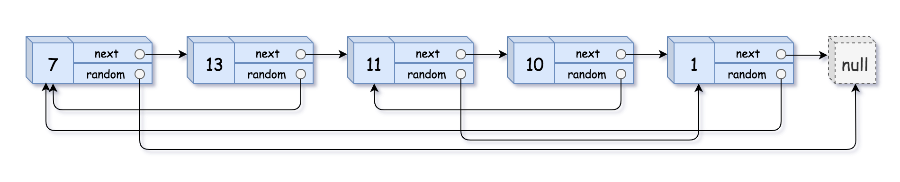
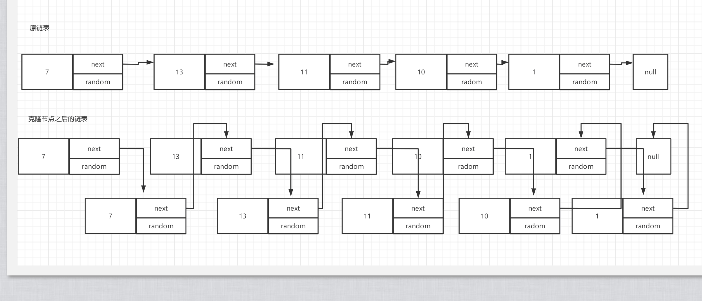

## 题目

给你一个长度为 `n` 的链表，每个节点包含一个额外增加的随机指针 `random` ，该指针可以指向链表中的任何节点或空节点。

构造这个链表的 深拷贝。 深拷贝应该正好由 `n` 个 全新 节点组成，其中每个新节点的值都设为其对应的原节点的值。新节点的 `next` 指针和 `random` 指针也都应指向复制链表中的新节点，并使原链表和复制链表中的这些指针能够表示相同的链表状态。复制链表中的指针都不应指向原链表中的节点 。

例如，如果原链表中有 `X` 和 `Y` 两个节点，其中 `X.random --> Y` 。那么在复制链表中对应的两个节点 `x` 和 `y` ，同样有 `x.random --> y` 。

返回复制链表的头节点。

用一个由 `n` 个节点组成的链表来表示输入/输出中的链表。每个节点用一个 `[val, random_index]` 表示：

- val：一个表示 `Node.val` 的整数。
- random_index：随机指针指向的节点索引（范围从 0 到 n-1）；如果不指向任何节点，则为 `null` 。

你的代码只接受原链表的头节点 `head` 作为传入参数。

## 示例 1：



```
输入：head = [[7,null],[13,0],[11,4],[10,2],[1,0]]
输出：[[7,null],[13,0],[11,4],[10,2],[1,0]]
```

示例 2：


```
输入：head = [[1,1],[2,1]]
输出：[[1,1],[2,1]]
```

示例 3：


```
输入：head = [[3,null],[3,0],[3,null]]
输出：[[3,null],[3,0],[3,null]]
```

## 提示：

- 0 <= n <= 1000
- -104 <= Node.val <= 104
- Node.random 为 null 或指向链表中的节点。
- Discussion | Solution

看到这个题目之后，有点懵逼，一时之间竟没有看懂，在反复读了几遍之后，结合示例总算是整明白了，就是克隆一个链表出来，但是他的值，以及指针指的都是克隆链表自己的，与原链表没有半毛钱关系，用 `js` 的话呢，来讲就是实现一个链表的深拷贝

题目分析

1. 判断链表是否为空，为空返回 null
2. 遍历链表，复制链表的每个节点，并将值复制成一样的，然后拼接在原节点的后面,克隆节点 random 指向的就是原节点的 random
3. 找到一个克隆的节点，修正克隆节点的 radom 指针，克隆节点指的是克隆节点
4. 拆分链表分为原节点链表和克隆节点链表

第一次循环我们每个节点产生一个克隆人

```
let p = head;
let q;
while (p) {
  q = new ListNode(p.val)
  q.next = p.next
  q.random = p.random

  // 原链表的节点指向该节点的克隆人
  p.next = q
  // 原链表的指针向后移动一位
  p = q.next
}
p = head.next
```


克隆节点创建完成之后，他的`random`指针指向有问题，他指的是原链表的指针，实际上他需要指向原链表的克隆节点，那不就是原链表的 `next`嘛

第二次循环，修正克隆节点的 `random` 指针

```
// 找到克隆节点
p = head.next
while (p) {
  // 修复指针
  if(p.random){
    p.random = p.random.next
  }
  // 克隆节点之间多了一个原节点因此需要走两步
  if(p.next){
    p = p.next.next
  }else{
    p = p.next
  }
}
```

第三次循环拆分链表,拆为原链表和克隆链表

```
p = q = head.next
// 循环的是原链表
while (q.next) {
  // 原链表
  head.next = head.next.next
  // 克隆链表
  q.next = q.next.next
  // 移动链表
  head = head.next
  q = q.next
}
```

当链表结束的时候，我们要设置 `head.next = null`, 因为原链表的下一个链表链接的不是他的克隆节点嘛，因此需要断开他们

## solution

```
/*
 * @lc app=leetcode.cn id=138 lang=javascript
 *
 * [138] 复制带随机指针的链表
 */

// @lc code=start
/**
 * // Definition for a Node.
 * function Node(val, next, random) {
 *    this.val = val;
 *    this.next = next;
 *    this.random = random;
 * };
 */

/**
 * @param {Node} head
 * @return {Node}
 */
var copyRandomList = function(head) {
    if(!head) return null
    let p = head;
    let q;
    while (p) {
      q = new ListNode(p.val)
      q.next = p.next
      q.random = p.random

      p.next = q
      p = q.next
    }
    p = head.next
    while (p) {
      if(p.random){
        p.random = p.random.next
      }
      if(p.next){
        p = p.next.next
      }else{
        p = p.next
      }
    }
    p = q = head.next
    while (q.next) {
      head.next = head.next.next
      q.next = q.next.next

      head = head.next
      q = q.next
    }
    head.next = null
    return p
};
// @lc code=end
```
