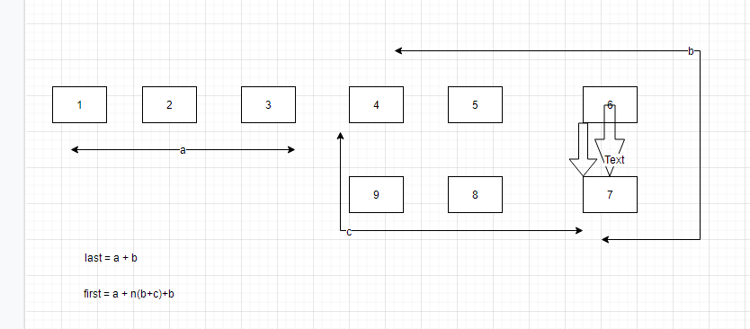

给定一个链表，返回链表开始入环的第一个节点。 如果链表无环，则返回 `null`。

如果链表中有某个节点，可以通过连续跟踪 `next` 指针再次到达，则链表中存在环。 为了表示给定链表中的环，评测系统内部使用整数 `pos` 来表示链表尾连接到链表中的位置（索引从 0 开始）。如果 `pos` 是 -1，则在该链表中没有环。

`注意：pos` 不作为参数进行传递，仅仅是为了标识链表的实际情况。

## 示例 1：


```
输入：head = [3,2,0,-4], pos = 1
输出：返回索引为 1 的链表节点
解释：链表中有一个环，其尾部连接到第二个节点。
```

## 示例 2：


```
输入：head = [1,2], pos = 0
输出：返回索引为 0 的链表节点
解释：链表中有一个环，其尾部连接到第一个节点。
```

## 示例 3：


```
输入：head = [1], pos = -1
输出：返回 null
解释：链表中没有环。
```

上次我们降到了如何判断一个链表有没有环，那有环的话我们怎么确定环开始的位置呢？
先看一下下面这张图


1. 假设从开始到环的入口距离是 `a` , 慢指针从环的入口到与快指针相遇时所走的距离是 `b`， 快慢指针相遇时的距离到环的入口的距离是 `c`
2. 慢指针与快指针相遇时，慢指针走的路程是 `a + b` , 快指针走的路程是 `a + n(b + c) + b`, `n` 是指所走的圈数
3. 由于快指针是慢指针速度的两倍，可以得出 `2(a + b) = a + n(b + c) + b`, 计算后到的 `a = n(b + c) - b = (n - 1)(b + c) + c`
4. 上面的公式 `(n - 1)`是圈数， `b + c` 是环的距离，那我们是不是可以理解为 `a = c` 呢？

可能有同学就不理解了 为啥 `(n - 1)(b + c)`可以约去呢？可以这样想，不管你走了多少圈，最终快指针和慢指针停留的位置是不是就在与入口相距 `c` 的位置呢？ `c` 的位置时相对的，既然是相对的那快指针转了 10 圈和 0 圈对我 `c` 有影响嘛？那必然没有呀对吧，如果想通了这个，我们是不是就能理解 `a = c` 了呢？

理解了 `a = c` ，那我们就接着往下进行

当快指针遇上了慢指针，我们在链表的顶部重新定义一个第三者 `temp`, 当这个第三者遇到慢指针的时候就相当于我们找到了这个环的入口，让他们两个相亲相爱去吧(谁让快指针不等等慢指针呢，月老拿的钢丝都能让它扯断了)

```
/*
 * @lc app=leetcode.cn id=142 lang=javascript
 *
 * [142] 环形链表 II
 */

// @lc code=start
/**
 * Definition for singly-linked list.
 * function ListNode(val) {
 *     this.val = val;
 *     this.next = null;
 * }
 */

/**
 * @param {ListNode} head
 * @return {ListNode}
 */
var detectCycle = function (head) {
  if (!head) return null
  let first = head
  let last = head
  while (first && first.next) {
    first = first.next.next
    last = last.next
    if (first == last) {
      let temp = head
      while (temp != last) {
        temp = temp.next
        last = last.next
      }
      return temp
    }
  }
  return null
};
// @lc code=end
```
