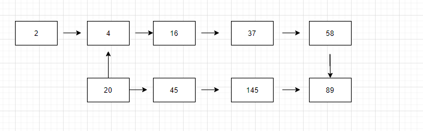

今天上完班就回家了，要先快乐起来！

编写一个算法来判断一个数 n 是不是快乐数。

「快乐数」定义为：

- 对于一个正整数，每一次将该数替换为它每个位置上的数字的平方和。
- 然后重复这个过程直到这个数变为 1，也可能是 无限循环 但始终变不到 1。
- 如果 可以变为 1，那么这个数就是快乐数。
- 如果 n 是快乐数就返回 true ；不是，则返回 false 。

## 示例 1：

```
输入：n = 19
输出：true
解释：
12 + 92 = 82
82 + 22 = 68
62 + 82 = 100
12 + 02 + 02 = 1
```

## 示例 2：

```
输入：n = 2
输出：false
```

提示：

```
1 <= n <= 231 - 1
```

看完示例我们画了个图

是不是很熟悉，这个不就是环形链表嘛，不同的是加了个平方求和
那我们先来看计算出每位数的值，先来思考，如果该位数只有一个 例如 2 我们使用 2 % 10 = 2 通过求余数的方法来计算个位数的，如果这个数是 2 位，3 位甚至更多呢?

是不是一时之间不知道怎么搞，当我们有了个位数的计算方法，那我们就一直计算个位数的就好了，当我们每计算完一个各位数我们就除以十把该数降位，然后循环计算直到该数字小于 0 就终止循环 getNext

我们接着看一下个难点，既然是快慢指针，我们终止的条件是什么呢？

1. 快指针的值等于慢指针
2. 快指针的值为 1

## solution

```
/*
 * @lc app=leetcode.cn id=202 lang=javascript
 *
 * [202] 快乐数
 */

// @lc code=start
/**
 * @param {number} n
 * @return {boolean}
 */
var isHappy = function (n) {
  let last = n
  let first = getNext(n)
  while (first != last && first != 1) {
    first = getNext(getNext(first))
    last = getNext(last)
  }
  return first == 1
};

var getNext = (n) => {
  let res = 0 // 个位数的平方和
  while (n > 0) {
    res += (n % 10) * (n % 10)
    n = Math.floor(n / 10)
  }
  return res
}
// @lc code=end
```
