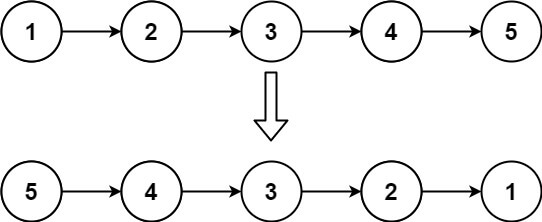
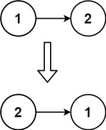
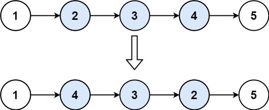

今天来了解一下关于反转链表的问题

## 反转链表 i

给你单链表的头节点 head ，请你反转链表，并返回反转后的链表。

### 示例 1：



```
输入：head = [1,2,3,4,5]
输出：[5,4,3,2,1]
```

### 示例 2：



```
输入：head = [1,2]
输出：[2,1]
```

### 示例 3：

```
输入：head = []
输出：[]
```

这个题其实还是比较简单的，我们先来确定一下思路，我们那拿示例 1 来举例

1. 首先我们定义 `cur` 为当前的节点， `pre` 默认为 `null` 为头节点
2. 先暂存 `cur.next`, 把当前节点的 `pre` 指向给当前节点的下一个节点，相当于 1 的下一个节点就是 `null`，也就是说没有下一个节点，到此结束， 即 1 指向 `null`
3. 把 `pre` 指向当前节点 `cur` , 当前节点指向我们之前暂存的 `next`
   然后看下每次执行的时候链表的变化如下程序：

```
第一次
pre :>>  1 [1]
cur :>>  1 [2,3,4,5]
第二次
pre :>>  2 [2,1]
cur :>>  2 [3,4,5]
第三次
pre :>>  3 [3,2,1]
cur :>>  3 [4,5]
第四次
pre :>>  4 [4,3,2,1]
cur :>>  4 [5]
第五次
pre :>>  5 [5,4,3,2,1]
cur :>>  5 null
```

这个流程看明白了后续的代码就理解起来就更简单了

### solution

```
/*
 * @lc app=leetcode.cn id=206 lang=javascript
 *
 * [206] 反转链表
 */

// @lc code=start
/**
 * Definition for singly-linked list.
 * function ListNode(val, next) {
 *     this.val = (val===undefined ? 0 : val)
 *     this.next = (next===undefined ? null : next)
 * }
 */
/**
 * @param {ListNode} head
 * @return {ListNode}
 */
var reverseList = function(head) {
  if(!head) return null
  let cur = head
  let pre = null
  while (cur) {
    // [cur.next, pre, cur] = [pre, cur, cur.next]
    let next = cur.next
    cur.next = pre
    pre = cur
    cur = next
  }
  return pre
};

// @lc code=end
```

上面的那个简单的理解了我们来看个它的进阶吧

## 反转链表 ii

给你单链表的头指针 `head` 和两个整数 `left` 和 `right` ，其中 `left <= right` 。请你反转从位置 `left` 到位置 `right` 的链表节点，返回 反转后的链表 。

### 示例 1：



```
输入：head = [1,2,3,4,5], left = 2, right = 4
输出：[1,4,3,2,5]
```

### 示例 2：

```
输入：head = [5], left = 1, right = 1
输出：[5]
```

这个题呢就是在反转部分链表，我们知道了反转的开始与结束的位置，中间部分的我们可以把它拆出来，当成一个链表用到我们上面的方法把它反转，然后和原来的链表连接起来不就 OK 了嘛

1. 按正常的情况链表一步一步往下走，直到需要链表反转的开始位置
2. 有了开始和结束位置，截断链表，利用上面那道题的方法进行反转链表
3. 需要暂存该链表头节点到 `left` 位置的链表
4. 拼接链表

### solution

```
/*
 * @lc app=leetcode.cn id=92 lang=javascript
 *
 * [92] 反转链表 II
 */

// @lc code=start
/**
 * Definition for singly-linked list.
 * function ListNode(val, next) {
 *     this.val = (val===undefined ? 0 : val)
 *     this.next = (next===undefined ? null : next)
 * }
 */
/**
 * @param {ListNode} head
 * @param {number} left
 * @param {number} right
 * @return {ListNode}
 */
var reverseBetween = function (head, left, right) {
  if (!head) return null
  let ret = new ListNode(-1, head)
  let pre = ret
  let n = right - left + 1
  while (--left) {
    pre = pre.next
  }
  pre.next = reserve(pre.next, n)
  return ret.next
};

function reserve(head, n) {
  let cur = head
  console.log('head :>> ', head);
  let pre = null
  while (n--) {
    [cur.next, pre, cur] = [pre, cur, cur.next]
  }
  head.next = cur
  return pre
}

// @lc code=end


```
