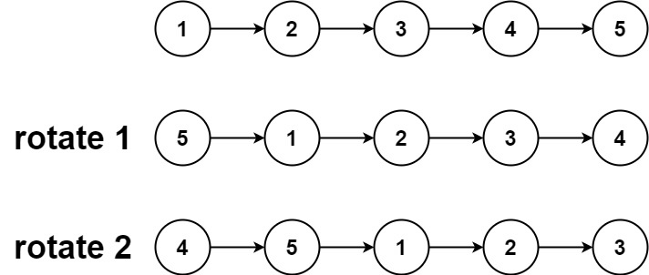
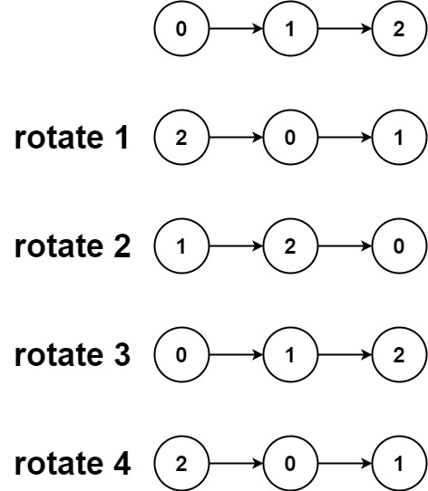

给你一个链表的头节点 head ，旋转链表，将链表每个节点向右移动 k 个位置。

## 示例 1：



```
输入：head = [1,2,3,4,5], k = 2
输出：[4,5,1,2,3]
```

## 示例 2：



```
输入：head = [0,1,2], k = 4
输出：[2,0,1]
```

## 提示：

- 链表中节点的数目在范围 [0, 500] 内
- -100 <= Node.val <= 100
- 0 <= k <= 2 \* 109

## solution

看到这个题目我们一看，他要求旋转链表，移动节点，这不就是循环这个链表嘛，然后向后移动 k 个位置嘛。有了思路，我们先来看看怎么把他搞成一个环形链表

1. 环形链表的话我们需要收尾相连，只需要把链表的最后一个节点指向头节点就可以了
2. 确定最后一个节点，需要先循环这个链表
3. 生成环形链表之后，向后移动 k 个位置
4. 最后断开这个链表

我们用示例一的例子来演示一下，确定链表的最后一个节点，向后移动的时候，我们需要知道移动到哪个位置，因此需要知道这个链表的长度

```
let cur = head // cur 1,2,3,4,5
let length = 1 // 从 1 开始因为 cur.next 的指向的是 2, 3, 4, 5
while(cur.next){
  cur = cur.next
  length ++
}
// 这个时候 length 为 5，cur 为 5
```

head 链表向后移动 k 个位置

```
12345 // 初始链表
51234 // 第一次移动
45123 // 第二次移动
k % length 是为了防止 k > length 时的情况
for(let i = 0; i < lenth - k % length - 1; i ++>){
  head = head.next
}
```

重新赋值，然后断开链表

```
/*
 * @lc app=leetcode.cn id=61 lang=javascript
 *
 * [61] 旋转链表
 */

// @lc code=start
/**
 * Definition for singly-linked list.
 * function ListNode(val, next) {
 *     this.val = (val===undefined ? 0 : val)
 *     this.next = (next===undefined ? null : next)
 * }
 */
//  输入：head = [1,2,3,4,5], k = 2
//  输出：[4,5,1,2,3]
/**
 * @param {ListNode} head
 * @param {number} k
 * @return {ListNode}
 */
var rotateRight = function (head, k) {
  if (!head) return null
  let cur = head

  let length = 1
  while (cur.next) {
    cur = cur.next
    length++
  }
  // 成环
  cur.next = head  // 51234
  // 找到节点断开
  // k % length - 1 当 k 大于链表的长度时 leng - k 是负数
  // length - k % length - 1  = 5 - 2 - 1 = 2
  for (let i = 0; i < length - k % length - 1; i++) {
    head = head.next
    // head 45123 1
  }

  cur = head.next
  head.next = null
  return cur
};
// @lc code=end

```
