# 探索 Vue3 初始化过程

## 1、准备工作

`vue` 源码地址 [https://github.com/vuejs/core](https://github.com/vuejs/core)
`vue3` 使用 `pnpm` 进行安装依赖

```
npm install -g pnpm

pnpm install

pnpm run dev
```

## 2、添加配置文件

添加 `--sourcemap`

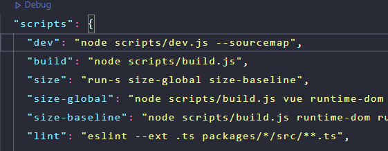

## 3、新建测试文件

packages/vue/examples/demo/create

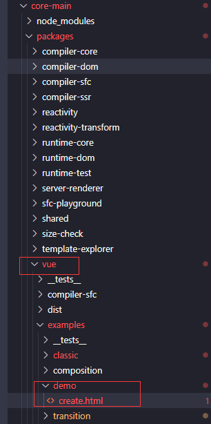

```
  <div id="App">
    {{ foo }}
  </div>
  <script src="./../../dist/vue.global.js"></script>
  <script>
    const { createApp , ref} = Vue
    createApp({
      setup(props) {
        const foo = ref('this is foo')
        return {
          foo
        }
      }
    }).mount('#App')
  </script>
```

## 4、切入口 createApp 分析

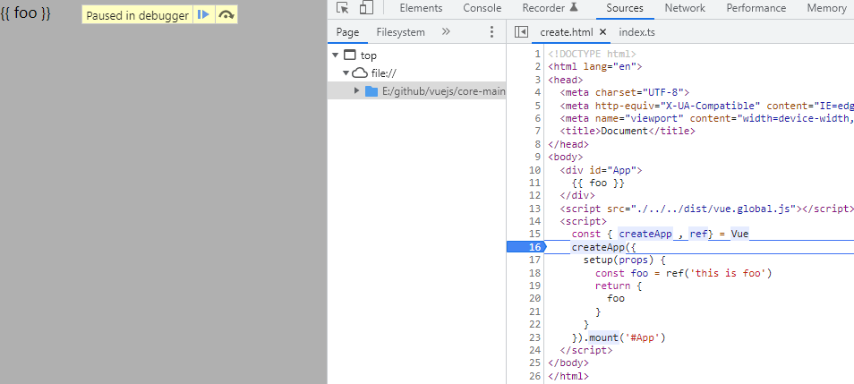

我们先从创建组件实例下手也就是 `createApp()`, 通过在 `createApp()` 处的断点切入进去，我们会看到创建组件实例的方法来自于 `ensureRenderer()`。

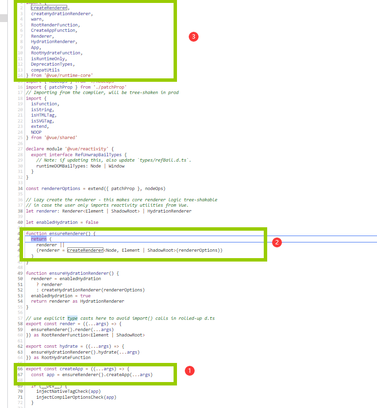

其次我们通过断点的方式找到这个函数来自于 `vue/runtime-core` 这个依赖包

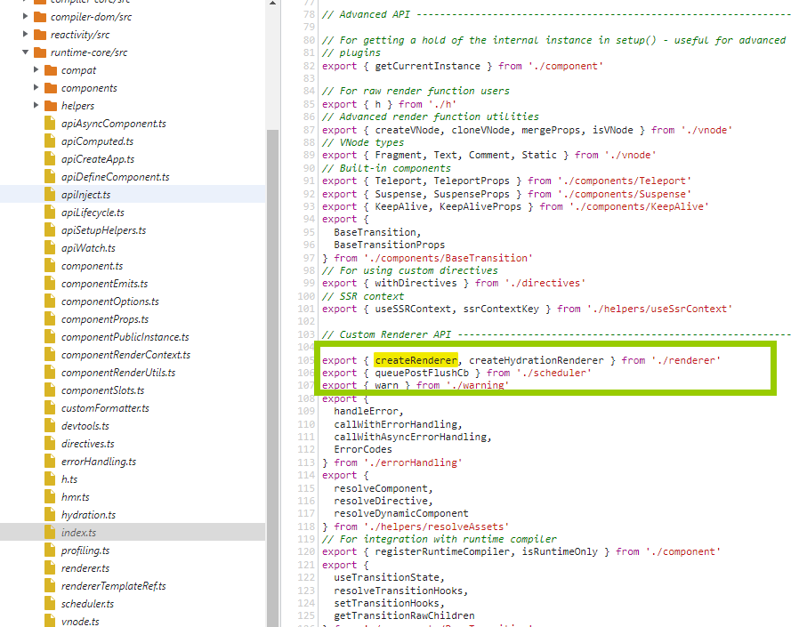

接着往下找，发现他来自一个叫 `render` 的方法

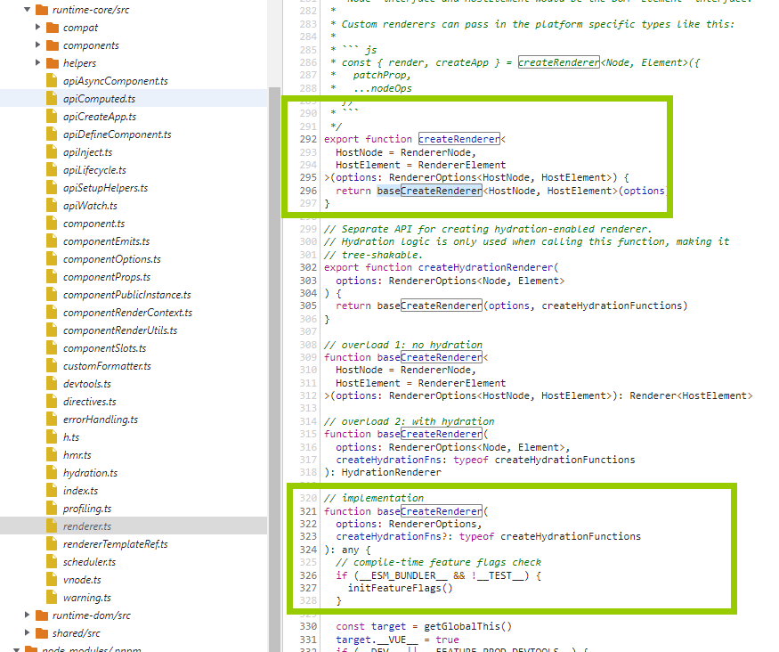

终于在 `render` 里面找到了这个` createRenderer()`, 它返回的是一个 `baseCreateRenderer()` 函数，这个函数又返回什么呢？

由于这个方法太长了，有 2000 多行，返回的是一个对象:

- render: 把接收到的 `vnode` 转换成 `dom`, 追加到宿主元素中
- hydtate: ssr 服务端将 `vnode` 生成 `html`
- creatApp: 创建 `App` 实例

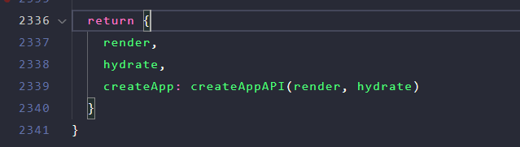

我们接着看 `createAppAPI` 这个函数，它来自 `apiCreateApp()` 这个方法

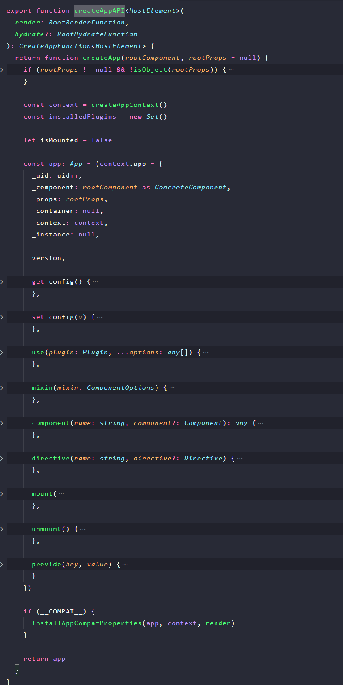

看到这个图是不是很熟悉？这个函数返回的就是 `createApp` 实例上的 `api`, 我们先重点看一下 `mount` 函数，当我们展开这个函数我们发现 `createApp` 里面传递的配置对象最终都会被 vue 当作 `rootComponent` 来处理。

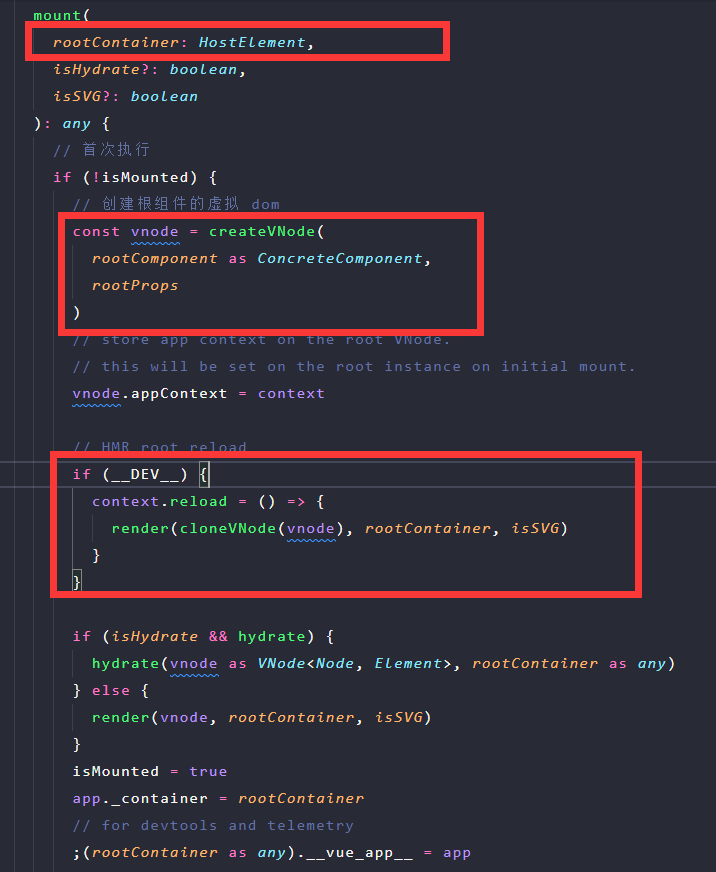

`mount` 函数在组建实例被创建后挂载到宿主元素上时，只会执行一次，即 `isMounted = fasle` 的时候，首次执行就会把传入的配置对象创建成 `vnode` 也就是所谓的虚拟 `dom` 随后通过 `render` 函数以及 `patch` 方法最终渲染成一颗真实的 `dom` 树。

我们看到 `render` 是从 `createAppAPI` 中的一个参数，那就往上一层找找看，果然在 `baseCreateRenderer` 这个里面让我们找到了

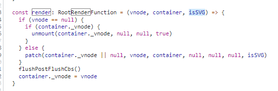

进入 `patch` 方法，发现它会执行 `processComponent`() 这个方法，这个方法里面又执行了一个叫 `mountComponent()` 的函数

```
const processComponent = (
  ...

  mountComponent(
    n2,
    container,
    anchor,
    parentComponent,
    parentSuspense,
    isSVG,
    optimized
  )
  ...
```

这个挂载组件 `mountComponent()` 里面有两个重要的东西，一个是 `createComponentInstance` 创建组件的实例，另一个就是 `setupComponent()` 初始化组件实例了。

```
const mountComponent: MountComponentFn = (
    initialVNode,
    container,
    anchor,
    parentComponent,
    parentSuspense,
    isSVG,
    optimized
  ) => {
    // 2.x compat may pre-create the component instance before actually
    // mounting
    // 组件实例
    const compatMountInstance =
      __COMPAT__ && initialVNode.isCompatRoot && initialVNode.component
    const instance: ComponentInternalInstance =
      compatMountInstance ||
      (initialVNode.component = createComponentInstance(
        initialVNode,
        parentComponent,
        parentSuspense
      ))

  ...
  setupComponent(instance)
  if (__DEV__) {
    endMeasure(instance, `init`)
  }
  ...
}
```

setupComponent

```
export function setupComponent(
  instance: ComponentInternalInstance,
  isSSR = false
) {
  isInSSRComponentSetup = isSSR

  const { props, children } = instance.vnode
  // 是否含有 setup data props 等等
  const isStateful = isStatefulComponent(instance)
  initProps(instance, props, isStateful, isSSR)
  initSlots(instance, children)

  const setupResult = isStateful
    ? setupStatefulComponent(instance, isSSR)
    : undefined
  isInSSRComponentSetup = false
  return setupResult
}
```

setupStatefulComponent
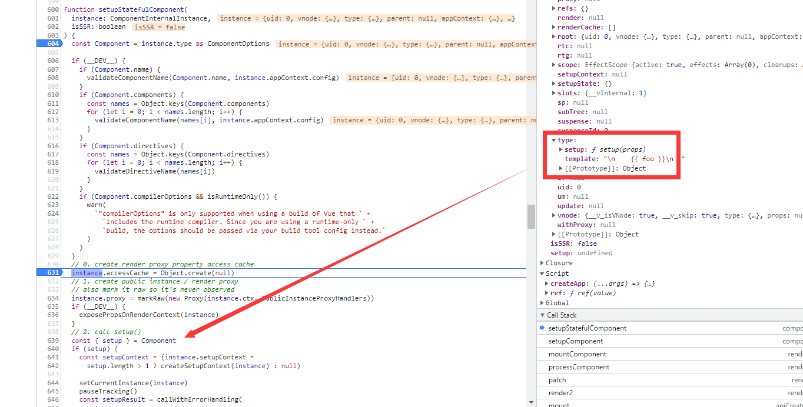
这里会对 setupResult 做出判断不是一个 Promise 对象的话就判断它的类型，看他是一个 function 還是一个 Object
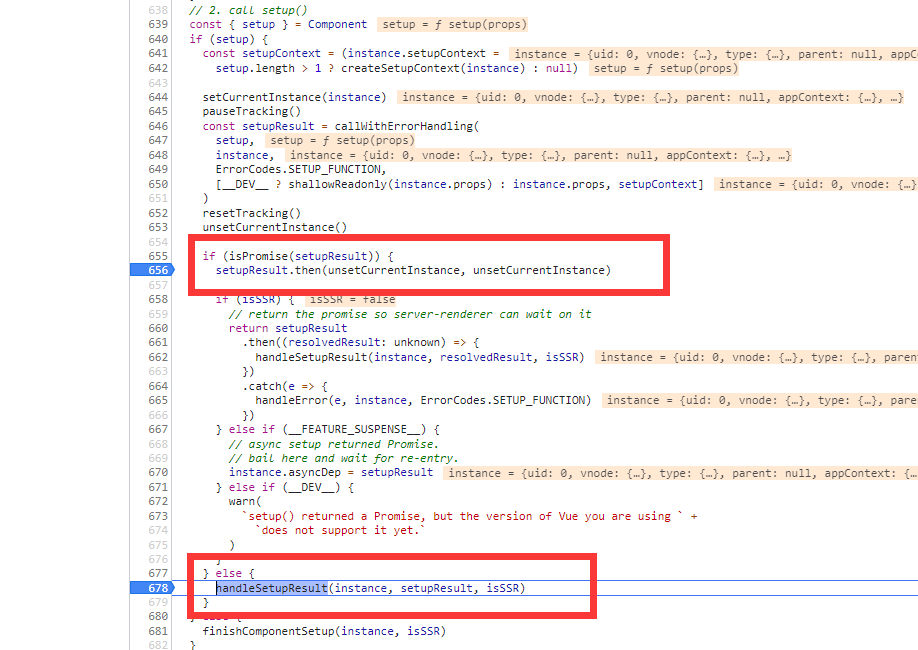
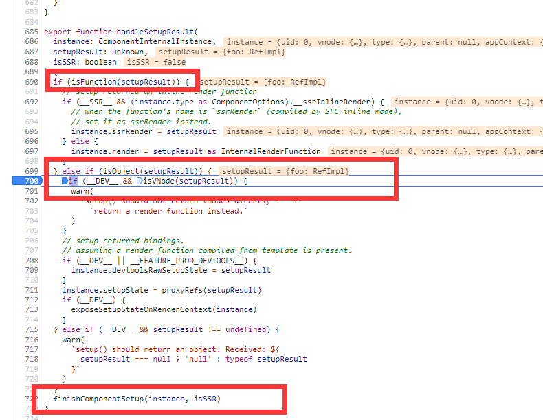

## 小结：

creatApp => ensureRenderer => baseCreateRenderer => createAppAPI => createApp => App

app.mount => render => patch => processComponent => mountComponent
